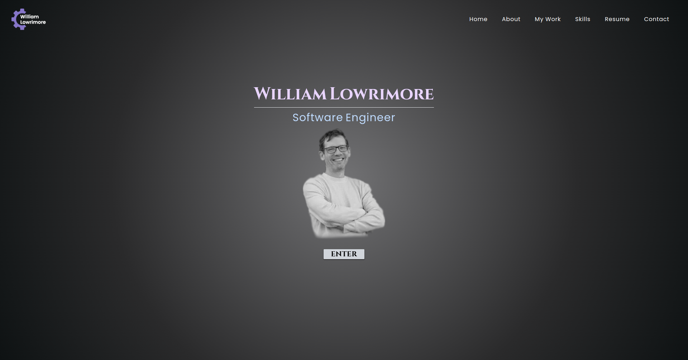

# Portfolio 2023

## Description

This is my latest portfolio.  It was built using React 18 with NextJS v13.4. In this portfolio you will find a clean layout with a soothing color palette, some pretty simple (but cool) animations, and easy navigation.  On the 'My Work' page I used the 'React Card Flip' package that shows the project image on the front of the card, and the description with a link to the code on the back of the card.  

The styling was created with, both TailwindCSS and Vanilla CSS (as were the animations). I also used 'React Icons' and Google Fonts via the next/font/google api. The Resume page features a link to my resume in pdf format where it can be viewed and/or printed. The Contact page features EmailJS, and links the user's sent message directly to my personal email account.  

This site is mobile responsive and has passed all audits through Lighthouse.  

## Sample Images

## Contact Information

You can contact me through the website [williamlowrimore.com](https://www.williamlowrimore.com).

### Other Ways to Make Contact
[Direct Email](mailto:wlowrimore@gmail.com) 
[Github](https://www.github.com/wlowrimore) 
[Linkedin](https://www.linkedin.com/in/william-lowrimore-21778310) 
[Slack](https://www.wlowrimore.slack.com)  

&copy; 2023 All Rights Reserved | William Lowrimore